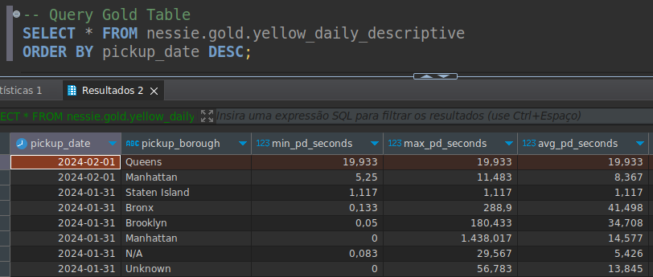

# Open Source Lakehouse

---

Open Source Lakehouse repo for study.

The main tool is Airflow for orchestration of Pyspark Lakehouse jobs.

With trino i can query in real time Landing in any available format (CSV and Parquet) and query Apache Iceberg tables from Nessie Catalog. 

The Minio Buckets is created with Terraform.

Nessie is the Metadata Catalog for Apache Iceberg, is possible to change to Open Source Unity Catalog.

Next Steps:

1. Add Exploratory Notebook;
2. Add MLFLOW;
3. Create Machine Learning Pipeline for Trip Data;
4. Improve Custom Docker Submit.
